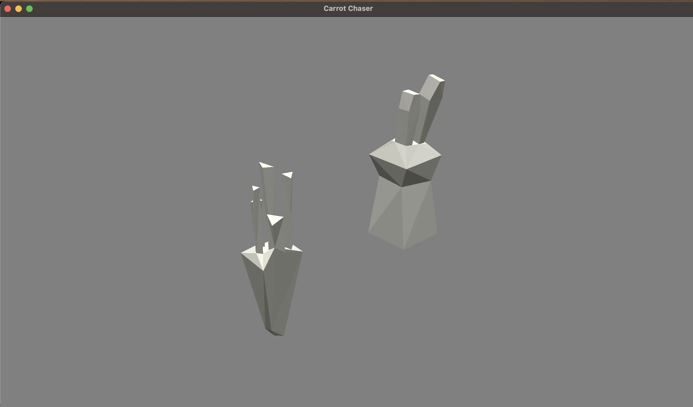

# Carrot Chaser

Author: Charvi Hoysal

Design: 
Was not able to execute this, but the goal was to have a carrot spawn randomly on a grid area and have the player move the bunny on the grid go collect the carrots, adding to a total score within a total time.
Currently, the game allows the player to move the bunny, and pressing space moves the carrot in a random position that is somewhat related to the bunny.

Credits:
Got some guidance from Mandy Hu (mandyh) on conceptual things and running the scripts to generate the scene file and meshes, did not use or look at any of her code though.

Screen Shot:

How To Play:

Use WASD to move the bunny around, and press space to move the carrot (it will move to a location that is based on the inverse of the direction the bunny is currently moving in)

This game was built with [NEST](NEST.md).
